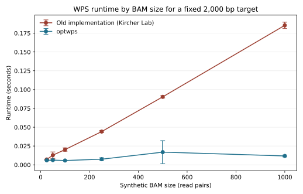
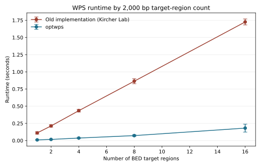
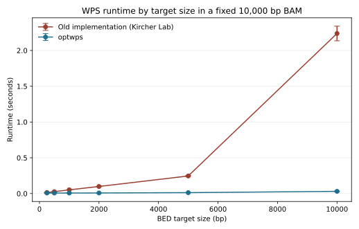

# optwps


[](https://github.com/VasLem/optwps/actions/workflows/tests.yml)
[](https://codecov.io/gh/VasLem/optwps)
[](https://doi.org/10.5281/zenodo.17566994)

A high-performance Python package for computing Window Protection Score (WPS) from BAM files, designed for cell-free DNA (cfDNA) analysis. It was built as a direct alternative of a script provided by the [Kircher Lab](https://github.com/kircherlab/cfDNA.git), and has been tested to replicate the exact numbers. We also optionally extend WPS, to account for GC and fragment size bias, using a histogram-based binning approach, while also allowing mappability-based hard-threshold filtering.

## Performance

The plot below compares the legacy implementation used in the regression tests with `optwps` while increasing only the synthetic BAM size. To only assess the algorithmic change, a single job was used (`--njobs 1`). The benchmark uses a fixed 2,000 bp BED target, varies the number of paired-end reads in the BAM, plots the mean runtime with standard-deviation error bars, and verifies that both implementations produce identical TSV output.



The plot below keeps each targeted BED region fixed at 2,000 bp and varies only the number of such regions.



The plot below keeps the synthetic BAM size fixed at 10,000 bp and varies only the size of one targeted BED region.



Recreate the plots with:

```bash
python benchmarks/plot_input_bam_size_comparison.py
python benchmarks/plot_region_count_comparison.py
python benchmarks/plot_target_size_comparison.py
```

## Installation

```bash
pip install optwps
```

### Dependencies

- Python >= 3.7
- samtools
- Python package dependencies are installed automatically by `pip`, including `pysam`, `numpy`, `pandas`, and `pyBigWig`.

## Usage

### Command Line Interface

Basic usage:

```bash
optwps -i input.bam -o output.tsv
```

With custom parameters:

```bash
optwps \
    -i input.bam \
    -o output.tsv \
    -w 120 \
    --min-insert-size 120 \
    --max-insert-size 180 \
    --downsample 0.5
```

With mappability filtering and bias correction:

```bash
optwps \
    -i input.bam \
    -o output.tsv \
    --mappability-file hg38_mappability.bw \
    --min-mappability 0.9 \
    --correct-for-bias
```

### Command Line Arguments

- `-i, --input`: Input BAM file (required)
- `-o, --output`: Output file path for WPS results. If not provided, results will be printed to stdout. Supports placeholders `{chrom}` and `{target}` for creating separate files per chromosome or region (optional)
- `-r, --regions`: BED file with regions of interest (default: whole genome, optional)
- `-w, --protection`: Base pair protection window (default: 120)
- `--min-insert-size`: Minimum read length threshold to consider (optional)
- `--max-insert-size`: Maximum read length threshold to consider (optional)
- `--mappability-file`: BigWig file with mappability scores used to filter fragments (optional)
- `--min-mappability`: Minimum average mappability score for fragments when `--mappability-file` is provided (default: 0.9)
- `--correct-for-bias`: Apply fragment length and GC-content bias correction weights to the outside and inside WPS counts
- `--bias-bins`: Number of bins per feature for bias-correction weights (default: 10)
- `--bias-subsample`: Fraction of reads used to estimate bias-correction weights (default: 0.05)
- `--bias-prior-count`: Pseudocount used to shrink rare-bin bias weights (default: 20.0)
- `--bias-min-weight`: Minimum fragment bias weight. Use a negative value to disable (default: 0.2)
- `--bias-max-weight`: Maximum fragment bias weight. Use a negative value to disable (default: 5.0)
- `--downsample`: Ratio to downsample reads (optional)
- `--chunk-size`: Chunk size for processing in pieces (default: 1e8)
- `--valid-chroms`: Comma-separated list of valid chromosomes to include (e.g., '1,2,3,X,Y') or 'canonical' for chromosomes 1-22, X, Y (optional)
- `--compute-coverage`: If provided, output will include base coverage
- `--verbose-output`: If provided, output will include separate counts for 'outside' and 'inside' along with WPS
- `--add-header`: If provided, output file(s) will have headers

### Python API

```python
from optwps import WPS

# Initialize WPS calculator
wps_calculator = WPS(
    protection_size=120,
    min_insert_size=120,
    max_insert_size=180,
    mappability_file='hg38_mappability.bw',
    min_mappability=0.9,
    correct_for_bias=True,
    valid_chroms=set(map(str, list(range(1, 23)) + ['X', 'Y']))
)

# Run WPS calculation
wps_calculator.run(
    bamfile='input.bam',
    out_filepath='output.tsv',
    downsample_ratio=0.5
)
```

## Output Format

The output is a tab-separated no-header (unless `--add-header` is specified) file with the following columns:

    - Chromosome name (without 'chr' prefix)
    - Start position (0-based)
    - End position (start + 1)
    - Base read coverage (if `--compute-coverage`)
    - Count of fragments spanning the protection window (if `--verbose-output`)
    - Count of fragment endpoints in protection window (if `--verbose-output`)
    - Window Protection Score (outside - inside)

When `--correct-for-bias` is used, the outside, inside, and WPS values are weighted and may be floating-point values.

Example output:

```
1\t1000\t1001\t12
1\t1001\t1002\t14
1\t1002\t1003\t10
```

With `--compute-coverage`
```
1\t1000\t1001\t20\t12
1\t1001\t1002\t20\t14
1\t1002\t1003\t19\t10
```

With `--verbose-output`:

```
1\t1000\t1001\t15\t3\t12
1\t1001\t1002\t16\t2\t14
1\t1002\t1003\t14\t4\t10
```

## Algorithm

The Windowed Protection Score [](https://doi.org/10.1016/j.cell.2015.11.050) algorithm counts how cfDNA fragments relate to a fixed protection window around each genomic position. `optwps` implements the original score and optionally extends it with mappability filtering and fragment-bias correction.

1. **Region and fragment collection**: For each BED interval, or for chunked whole-genome regions when no BED file is provided, `optwps` fetches overlapping BAM reads and converts them to fragments. Paired-end reads use the inferred template coordinates; single-end reads use the aligned reference length.

2. **Read filtering**: Duplicate, QC-failed, unmapped, soft-clipped, discordant paired-end, zero-length, and out-of-range insert-size fragments are skipped. When `--mappability-file` is provided, each fragment must also have an average BigWig mappability score of at least `--min-mappability`.

3. **Protection window**: For each genomic position, define a centered window of size `protection_size` (default 120 bp, or +/-60 bp from the center).

4. **Uncorrected score calculation**:
   - **Outside score**: Count fragments that completely span the protection window.
   - **Inside score**: Count fragment endpoints that fall inside the protection window.
   - **WPS**: Subtract inside from outside: `WPS = outside - inside`.

5. **Optional bias correction**: With `--correct-for-bias`, `optwps` estimates inverse-frequency weights from a subsample of valid reads. The current features are fragment length and read GC content, binned with `--bias-bins`; the subsample size is controlled by `--bias-subsample`. Rare bins are stabilized with `--bias-prior-count` and bounded by `--bias-min-weight` / `--bias-max-weight`, so sparse fragment classes cannot dominate the corrected WPS. During WPS calculation, each fragment contributes its weight instead of `1` to both outside and inside counts, so:

   `corrected WPS = weighted outside - weighted inside`

   Bias-corrected `outside`, `inside`, and `wps` values can therefore be floating-point values.

6. **Interpretation**: Positive WPS values indicate protected regions, often consistent with nucleosome-bound DNA, while negative values suggest more accessible regions.


## Examples

### Example 1: Basic WPS Calculation

```bash
optwps -i sample.bam -o sample_wps.tsv
```

### Example 2: Providing a regions bed file, limiting the range of the size of the inserts considered, and printing to the terminal

```bash
optwps \
    -i sample.bam \
    -r regions.tsv \
    --min-insert-size 120 \
    --max-insert-size 180
```

### Example 3: Specific Regions with Downsampling

```bash
optwps \
    -i high_coverage.bam \
    -o wps.tsv \
    --downsample 0.3
```

### Example 4: Creating Separate Output Files per Chromosome

```bash
optwps \
    -i sample.bam \
    -o "wps_{chrom}.tsv"
```

### Example 5: Include coverage

```bash
optwps \
    -i sample.bam \
    --compute-coverage \
    -o "wps.tsv"
```

### Example 6: Bias-corrected WPS

```bash
optwps \
    -i sample.bam \
    -o sample_bias_corrected_wps.tsv \
    --correct-for-bias \
    --bias-bins 10 \
    --bias-subsample 0.05
```
